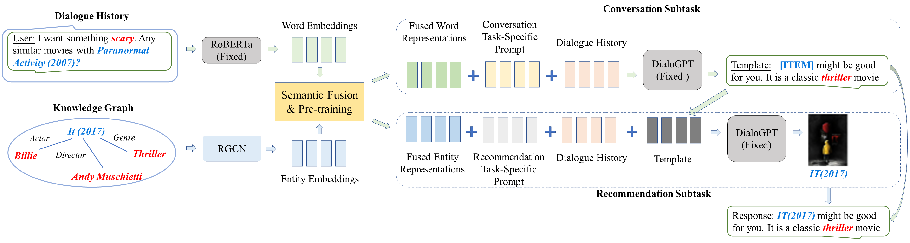

# UniCRS

This is the official PyTorch implementation for the paper:

> Xiaolei Wang*, Kun Zhou*, Ji-Rong Wen, Wayne Xin Zhao. Towards Unified Conversational Recommender Systems via Knowledge-Enhanced Prompt Learning. KDD 2022.

## Overview

we proposed a novel conversational recommendation model named **UniCRS** to fulfill both the recommendation and conversation subtasks in a _unified_ approach. First, taking a fixed PLM (DialoGPT) as the backbone, we utilized a knowledge-enhanced prompt learning paradigm to reformulate the two subtasks. Then, we designed multiple effective prompts to support both subtasks, which include fused knowledge representations generated by a pre-trained semantic fusion module, task-specific soft tokens, and the dialogue context. We also leveraged the generated response template from the conversation subtask as an important part of the prompt to enhance the recommendation subtask. The above prompt design can provide sufficient information about the dialogue context, task instructions, and the background knowledge. By only optimizing these prompts, our model can effectively accomplish both the recommendation and conversation subtasks.



## Requirements

- python == 3.8.13
- pytorch == 1.8.1
- cudatoolkit == 11.1.1
- transformers == 4.15.0
- pyg == 2.0.1
- accelerate == 0.8.0

## Download Datasets

[//]: # (## Download Datasets and Pre-trained Model)

Please download DBpedia from the [link](https://databus.dbpedia.org/dbpedia/mappings/mappingbased-objects/2021.09.01/mappingbased-objects_lang=en.ttl.bz2), after unzipping, move it into `data/dbpedia`.

[//]: # (You can download our [pre-triained prompt]&#40;#prompt-pre-training&#41; from [Google Drive]&#40;https://drive.google.com/drive/folders/18wxR3atXasSwRRAvlkeJ5J8qLnR0I2bk?usp=sharing&#41;.)


## Quick-Start

We run all experiments and tune hyperparameters on a RTX3090 with 24GB memory, you can adjust `per_device_train_batch_size` and `per_device_eval_batch_size` according to your GPU, and then the optimization hyperparameters (e.g., `learning_rate`) may also need to be tuned.

### Data processing

```bash
cd data
python dbpedia/extract_kg.py

# redial
python redial/extract_subkg.py
python redial/remove_entity.py

# inspired
python inspired/extract_subkg.py
python inspired/remove_entity.py
```

### Prompt Pre-training

```bash
cp -r data/redial src/data/
cd src
python data/redial/process.py
accelerate launch train_pre.py \
    --dataset redial \  # [redial, inspired]
    --tokenizer microsoft/DialoGPT-small \
    --model microsoft/DialoGPT-small \
    --text_tokenizer roberta-base \
    --text_encoder roberta-base \
    --num_train_epochs 5 \
    --gradient_accumulation_steps 1 \
    --per_device_train_batch_size 64 \
    --per_device_eval_batch_size 128 \
    --num_warmup_steps 1389 \  # 168 for inspired
    --max_length 200 \
    --prompt_max_length 200 \
    --entity_max_length 32 \
    --learning_rate 5e-4 \  # 6e-4 for inspired
    --output_dir /path/to/pre-trained prompt \  # set your own save path
    --use_wandb \  # if you do not want to use wandb, comment it and the lines below
    --project crs-prompt-pre \  # wandb project name
    --name xxx  # wandb experiment name
```

### Conversation Task Training and Inference

```bash
# train
cp -r data/redial src/data/
cd src
python data/redial/process_mask.py
accelerate launch train_conv.py \
    --dataset redial \  # [redial, inspired]
    --tokenizer microsoft/DialoGPT-small \
    --model microsoft/DialoGPT-small \
    --text_tokenizer roberta-base \
    --text_encoder roberta-base \
    --n_prefix_conv 20 \  
    --prompt_encoder /path/to/pre-trained prompt \  # set to your save path of the pre-trained prompt
    --num_train_epochs 10 \
    --gradient_accumulation_steps 1 \
    --ignore_pad_token_for_loss \
    --per_device_train_batch_size 8 \
    --per_device_eval_batch_size 16 \
    --num_warmup_steps 6345 \  # 976 for inspired
    --context_max_length 200 \
    --resp_max_length 183 \
    --prompt_max_length 200 \
    --entity_max_length 32 \
    --learning_rate 1e-4 \
    --output_dir /path/to/prompt for conversation \  # set your own save path
    --use_wandb \  # if you do not want to use wandb, comment it and the lines below
    --project crs-prompt-conv \  # wandb project name
    --name xxx  # wandb experiment name
    
# infer
accelerate launch infer_conv.py \
    --dataset redial \  # [redial, inspired]
    --split train \  # [train, valid, test] run all of the three options for each dataset
    --tokenizer microsoft/DialoGPT-small \
    --model microsoft/DialoGPT-small \
    --text_tokenizer roberta-base \
    --text_encoder roberta-base \
    --n_prefix_conv 20 \
    --prompt_encoder /path/to/prompt for conversation \  # set to your save path of the prompt for conversation
    --per_device_eval_batch_size 64 \
    --context_max_length 200 \
    --resp_max_length 183 \
    --prompt_max_length 200 \
    --entity_max_length 32
```

### Recommendation Task

```bash
# merge infer results from conversation
# redial
cd src
cp -r data/redial/. data/redial_gen/
python data/redial_gen/merge.py --gen_file_prefix xxx # check it in save/redial, e.g., fill in dialogpt_prompt-pre_prefix-20_redial_1e-4 if you see dialogpt_prompt-pre_prefix-20_redial_1e-4_train/valid/test.jsonl
# inspired
cd src
cp -r data/inspired/. data/inspired_gen/
python data/inspired_gen/merge.py --gen_file_prefix xxx # check it in save/inspired, e.g., fill in dialogpt_prompt-pre_prefix-20_inspired_1e-4 if you see dialogpt_prompt-pre_prefix-20_inspired_1e-4_train/valid/test.jsonl

accelerate launch train_rec.py \
    --dataset redial_gen \  # [redial_gen, inspired_gen]
    --tokenizer microsoft/DialoGPT-small \
    --model microsoft/DialoGPT-small \
    --text_tokenizer roberta-base \
    --text_encoder roberta-base \
    --n_prefix_rec 10 \
    --prompt_encoder /path/to/pre-trained prompt \  # set to your save path of the pre-trained prompt
    --num_train_epochs 5 \
    --per_device_train_batch_size 64 \
    --per_device_eval_batch_size 64 \
    --gradient_accumulation_steps 1 \
    --num_warmup_steps 530 \  # 33 for inspired_gen
    --context_max_length 200 \
    --prompt_max_length 200 \
    --entity_max_length 32 \
    --learning_rate 1e-4 \
    --output_dir /path/to/prompt for recommendation \
    --use_wandb \  # if you do not want to use wandb, comment it and the lines below
    --project crs-prompt-rec \  # wandb project name
    --name xxx  # wandb experiment name
```

## Contact

If you have any questions for our paper or codes, please send an email to wxl1999@foxmail.com.

## Acknowledgement

Special thanks the CRS toolkit [CRSLab](https://github.com/RUCAIBox/CRSLab), we use it to run experiments of baseline models.

Please cite the following papers as the references if you use our codes or the processed datasets.

```bibtex
@inproceedings{wang2022towards,
  title={Towards Unified Conversational Recommender Systems via Knowledge-Enhanced Prompt Learning},
  author={Wang, Xiaolei and Zhou, Kun and Wen, Ji-Rong and Zhao, Wayne Xin},
  booktitle={Proceedings of the 28th ACM SIGKDD Conference on Knowledge Discovery and Data Mining},
  pages={1929--1937},
  year={2022}
}
```
